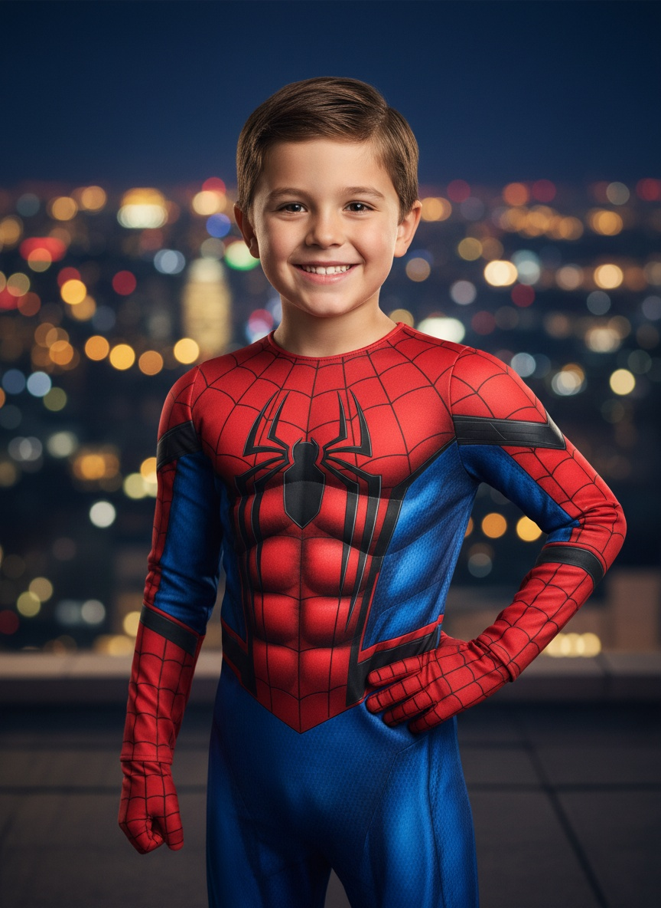

# Renfo.studio

**Фото ребёнка → образ мечты. Лицо — на 100% родное.**

Desktop-приложение для детских фотографов: батч-генерация стилизованных
портретов (супергерои, принцессы, фэнтези, космос, профессии) с идеальным
сохранением лица. Печать 2K · 300 dpi, PSD-экспорт для ретуши.

> Ребёнок на изображении — синтетический, сгенерирован ИИ; такого человека не существует.

- **Сайт:** https://markbrutx.github.io/renfo-studio/
- **Скачать (Windows):** https://github.com/markbrutx/renfo-studio/releases/latest

Стек: Tauri 2 · Rust · React · TypeScript · Zustand · fal.ai · Supabase · GitHub Actions.

Этот репозиторий содержит релизы и артефакты автообновления.
